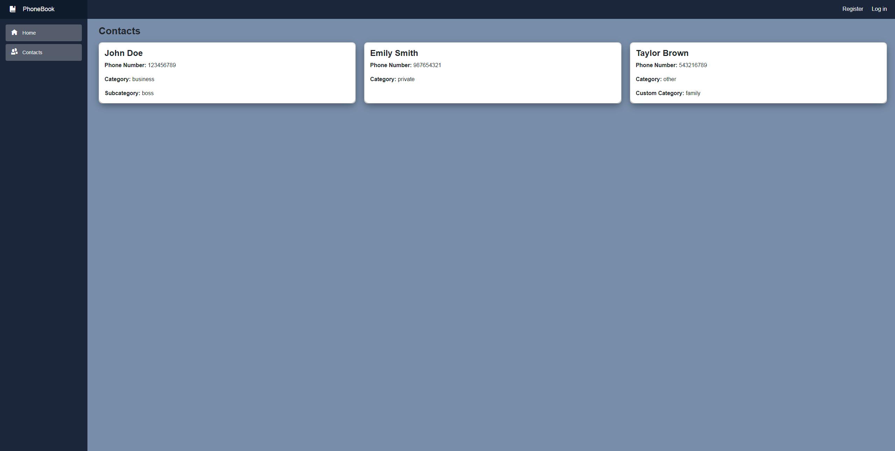
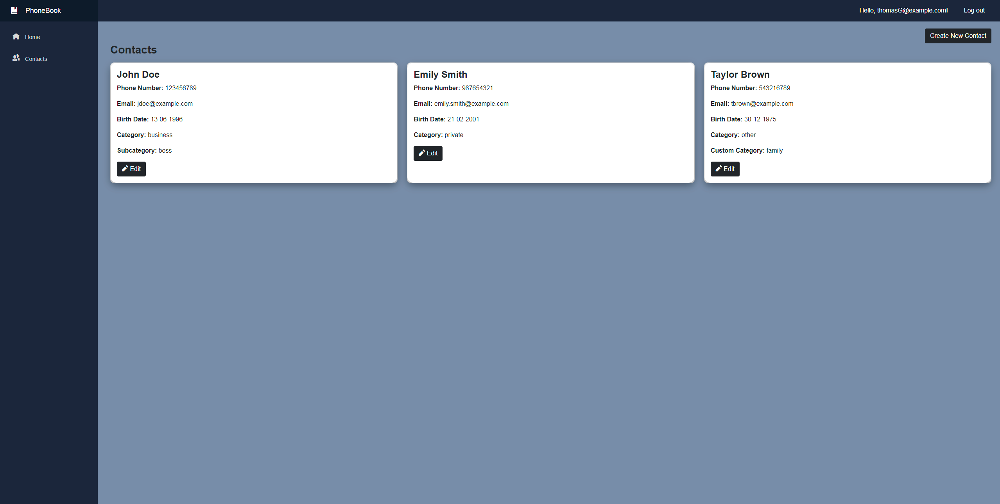
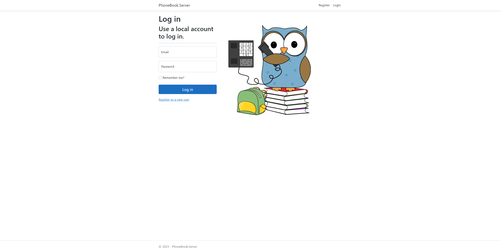
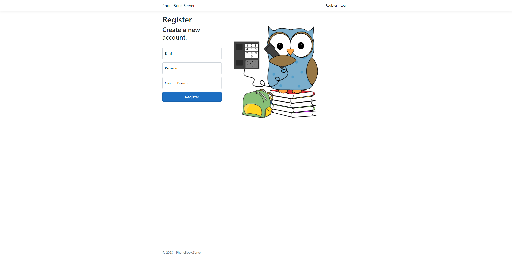
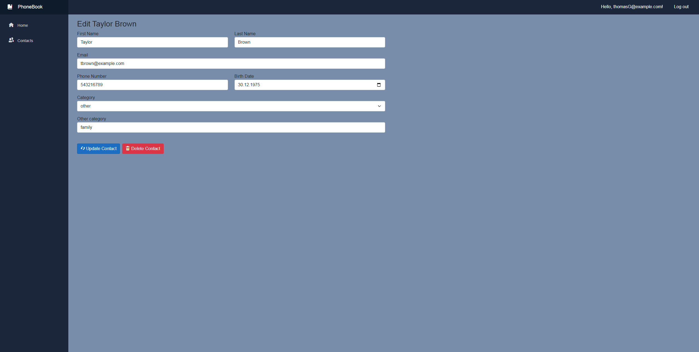
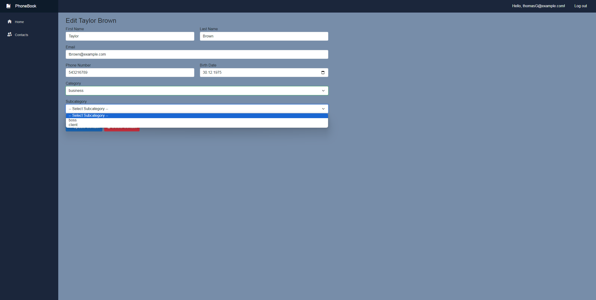
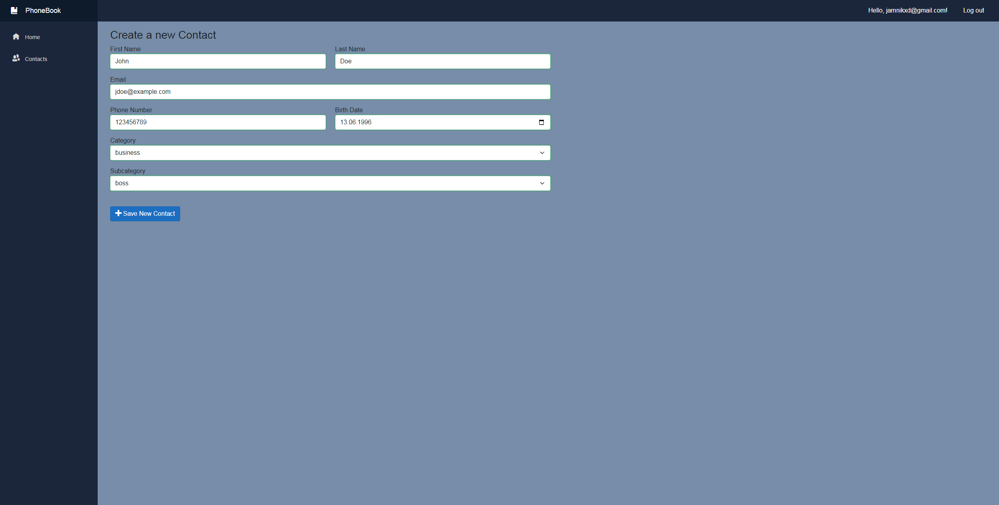

# PhoneBook

## Description
PhoneBook is a full-stack application built using Blazor WebAssembly with .NET 7.0, ASP.NET Core Hosted, Entity Framework Core, Identity, and Microsoft SQL Server. 
The application follows the Model-View-Controller (MVC) architectural pattern, providing a well-organized and maintainable codebase.

In order to test the operation of the application, a sample database file has been attached to the project files.
It can be found in a folder:
> PhoneBook/Example Database

# Features
1. Contacts List:
   - The application presents users with a visually appealing list of contacts, displaying their basic information.
   - If user is logged in, it allows to add new contacts and view the details of existing ones.
2. Contact Details:
   - Only logged in users can view this page.
   - Each contact entry includes essential details such as first name, last name, email, category, subcategory (for _business_ category), phone number, and date of birth and user categories (for _other_ category).
   - Here the user can edit or delete the contact.
3. Login / Register:
   - These pages enable user authentication.

## App screenshots

